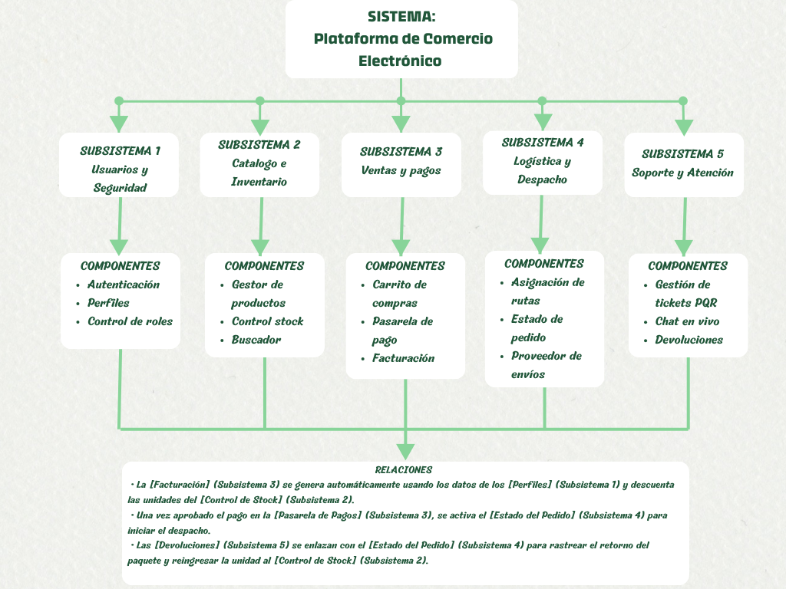
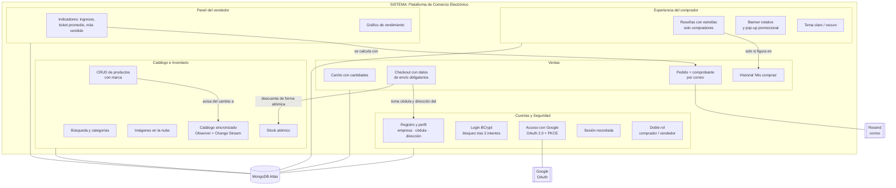
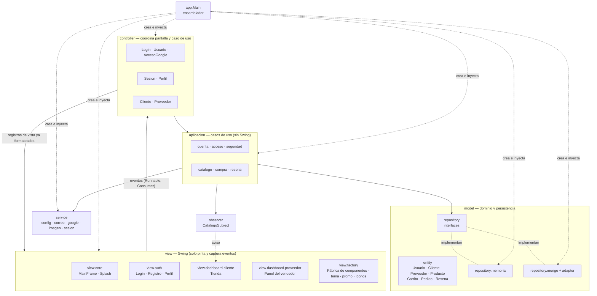
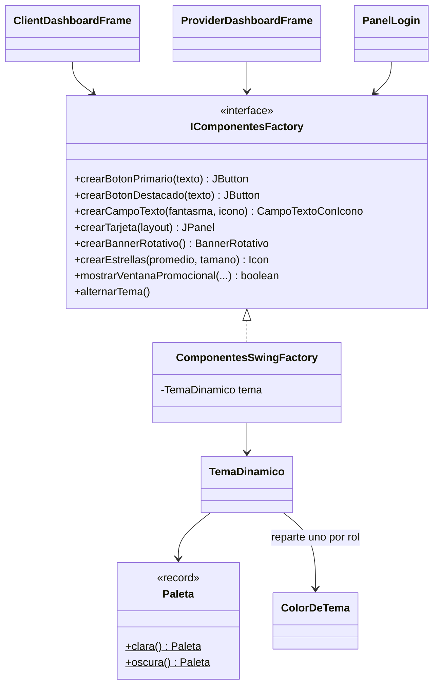
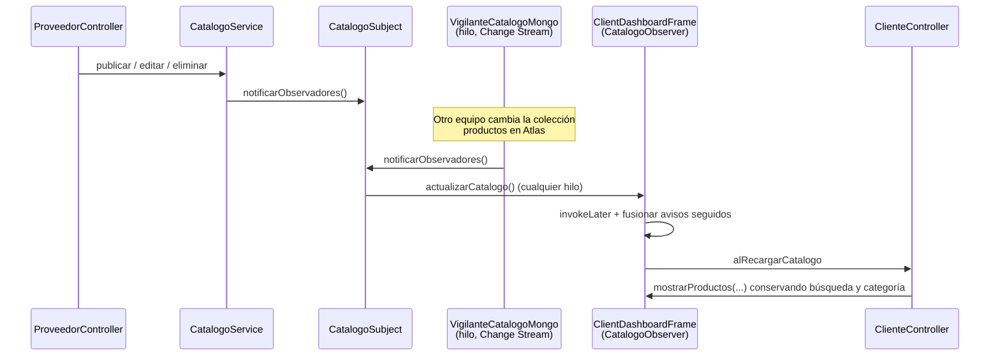
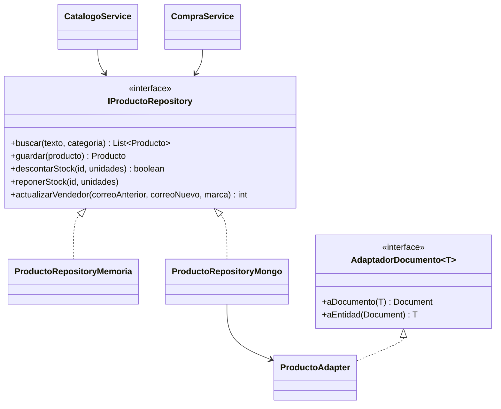

# Arquitectura y diseño

**Plataforma de Comercio Electrónico** — Java 26 · Swing (FlatLaf 3.7.2) · MongoDB Atlas
Documento técnico para la sustentación final.

> Los diagramas están escritos en Mermaid: se ven como gráficos en GitHub,
> GitLab, VS Code (con la extensión *Markdown Preview Mermaid*) o en
> <https://mermaid.live>.

---

## 1. Evolución del diagrama conceptual

### 1.1 Estado inicial

El primer diagrama describía la plataforma como **cinco subsistemas
funcionales** colgando de un sistema, cada uno con tres componentes, y tres
relaciones de negocio entre ellos:

| Subsistema inicial | Componentes previstos |
|---|---|
| 1. Usuarios y Seguridad | Autenticación, Perfiles, Control de roles |
| 2. Catálogo e Inventario | Gestor de productos, Control de stock, Buscador |
| 3. Ventas y Pagos | Carrito de compras, Pasarela de pago, Facturación |
| 4. Logística y Despacho | Asignación de rutas, Estado de pedido, Proveedor de envíos |
| 5. Soporte y Atención | Tickets PQR, Chat en vivo, Devoluciones |

Era un mapa de **qué** debía hacer el sistema. No decía **cómo** se iba a
construir: no tenía capas, ni dependencias, ni persistencia, ni dónde vivía
cada regla.

### 1.2 Qué cambió y por qué

El diseño final ya no se organiza por subsistemas funcionales, sino en
**capas** (MVC + capa de aplicación) que se repiten para cada funcionalidad.
Las funcionalidades del diagrama inicial siguen ahí, pero repartidas por
responsabilidad técnica.

| Subsistema inicial | Estado final | Dónde vive hoy |
|---|---|---|
| **1. Usuarios y Seguridad** | **Implementado y ampliado** | `aplicacion.cuenta` (registro, perfil, empresa, cédula y dirección), `aplicacion.acceso` (login), `aplicacion.seguridad` (BCrypt, política de contraseñas, bloqueo tras 3 intentos), `service.google` (OAuth 2.0 con PKCE), `service.sesion` (sesión recordada) |
| — Control de roles | **Rediseñado como doble rol** | `Usuario.puedeVender()`: todo usuario compra; el Proveedor además vende y ve "Gestionar tienda" |
| **2. Catálogo e Inventario** | **Implementado y ampliado** | `aplicacion.catalogo` (CRUD, reporte de ventas, imágenes portables), `Producto.marca`, búsqueda sin acentos, `observer` (catálogo sincronizado entre equipos) |
| — Control de stock | **Reforzado** | Descuento atómico en MongoDB (`$inc` con filtro `stock >= n`) y compensación si una compra falla |
| **3. Ventas y Pagos** | **Implementado parcialmente** | `Carrito` (cantidades editables), `aplicacion.compra.CompraService` (compra todo-o-nada) |
| — Pasarela de pago | **No implementada** | Fuera del alcance académico: la compra se confirma sin cobro real |
| — Facturación | **Reemplazada por comprobante** | Pedido con documento del comprador y correo de confirmación HTML (`service.correo`) |
| **4. Logística y Despacho** | **Reducido** | Solo la dirección de envío obligatoria antes de comprar. Rutas, estados de pedido y transportadoras quedan como trabajo futuro |
| **5. Soporte y Atención** | **Sustituido** | En vez de PQR/chat se implementaron **reseñas con estrellas** (retroalimentación del comprador). Devoluciones: trabajo futuro |
| *(no existía)* | **Nuevo** | Imágenes en la nube (`IImagenRepository`), promociones (banner rotativo y pop-up), tema claro/oscuro en caliente, correos transaccionales (Resend) |

Las tres relaciones del diagrama inicial también se transformaron:

| Relación inicial | Cómo quedó |
|---|---|
| La Facturación usa los Perfiles y descuenta el Stock | `CompraService.confirmar` toma la cédula y la dirección del **perfil**, descuenta el **stock** de forma atómica y registra el pedido. Si falta un dato del perfil, la compra se bloquea antes de tocar el stock |
| El pago aprobado activa el Estado del pedido | Sin pasarela de pago: confirmar la compra registra el pedido y dispara los correos de confirmación (comprador) y de venta (tienda) |
| Las Devoluciones reingresan unidades al Stock | No hay devoluciones, pero el mecanismo de reingreso existe: `reponerStock` devuelve las unidades si una compra no puede completarse |

### 1.3 Diagrama conceptual rediseñado (estado final)

---

## 2. Arquitectura en capas

**Reglas de dependencia** (comprobadas con `grep` en cada entrega):

- `view` **nunca** importa `model`. Los controladores traducen las entidades
  a registros propios de la vista (`TarjetaProducto`, `LineaCarrito`,
  `IndicadorVentas`…) con los importes ya formateados.
- `model` y `aplicacion` **nunca** importan `javax.swing`.
- Ningún controlador conoce un `SwingWorker`: pide
  `vista.ejecutarEnSegundoPlano(...)` y la vista decide cómo se ve la espera.
- Solo `app.Main` conoce las implementaciones concretas. La excepción
  deliberada es `SesionController`, que instancia las dos ventanas de la
  sesión porque es el caso de uso que decide cuál abrir.

**Tamaño:** 139 clases en 32 paquetes.

---

## 3. Patrones de diseño

### 3.1 MVC (Modelo-Vista-Controlador)

| Capa | Responsabilidad | Ejemplo |
|---|---|---|
| **Modelo** | Reglas del dominio y persistencia | `Producto.descontarStock()` se niega a dejar el stock negativo; `Usuario.datosDeEnvioCompletos()` decide si se puede comprar |
| **Vista** | Pintar y capturar eventos; no valida ni calcula | `ClientDashboardFrame` recibe `TarjetaProducto` y devuelve `NuevaResena` sin validar |
| **Controlador** | Coordinar pantalla y caso de uso | `ClienteController.confirmarCompra()` pide los datos de envío si faltan y lanza la compra en segundo plano |

Cada vista se define por un **contrato** (`ILoginView`,
`IClienteDashboardView`, `IProveedorDashboardView`, `IPerfilView`). Esto
permite probar los controladores con vistas falsas, sin abrir ventanas.

Además de las tres capas clásicas hay una **capa de aplicación**
(`aplicacion.*`). Las reglas que vivían repartidas entre varios
controladores (qué es un precio válido, quién puede reseñar, cuándo una
compra es todo-o-nada) se movieron a servicios sin Swing que pueden
reutilizarse y probarse aislados.

### 3.2 Factory (Fábrica de componentes)

- **Ninguna vista crea un `Color`, una `Font` ni un botón con estilo.** Todo
  sale de `IComponentesFactory`, que es la única que conoce colores,
  tipografía, bordes y efectos.
- **Un tema nuevo es otra `Paleta`**, sin tocar la fábrica ni las vistas
  (principio Abierto/Cerrado).
- **Colores vivos:** la fábrica no reparte colores fijos sino `ColorDeTema`,
  que se resuelve contra la paleta vigente cada vez que se pinta. Por eso el
  conmutador claro/oscuro recolorea la aplicación abierta **sin cerrar ninguna
  ventana**: cambia la paleta, instala `FlatLightLaf`/`FlatDarkLaf`, ejecuta
  `SwingUtilities.updateComponentTreeUI` y repinta, con un fundido.
- Los **repositorios en memoria y Mongo** se eligen con el mismo principio:
  `app.Main` decide una vez (`abrirConexion()`) y el resto del programa solo
  conoce las interfaces.

### 3.3 Observer (catálogo sincronizado)

- **Sujeto:** `observer.CatalogoSubject` (lista `CopyOnWriteArrayList`,
  porque se recorre desde el hilo del vigilante mientras el hilo de eventos
  suscribe o da de baja).
- **Observador:** la tienda (`ClientDashboardFrame`). Recibe el aviso, salta
  al hilo de eventos y funde los avisos seguidos: una compra de cinco
  productos genera cinco avisos y **una sola** recarga (medido).
- **Fuentes del aviso:** el caso de uso del catálogo (cambios locales) y un
  *Change Stream* de MongoDB (cambios hechos desde **otros equipos**).
- **Baja automática:** `SesionController` da de baja la ventana al cerrarse,
  para que el sujeto no la retenga en memoria.

### 3.4 Repository (+ Adapter)

- **Cinco contratos:** `IUsuarioRepository`, `IProductoRepository`,
  `IPedidoRepository`, `IResenaRepository` e `IImagenRepository`.
- **Dos implementaciones de cada uno:** memoria (la aplicación funciona sin
  red) y MongoDB Atlas. `app.Main` elige una sola vez.
- **Adapter:** los repositorios Mongo solo consultan; la conversión
  entidad ↔ documento vive en `model.repository.mongo.adapter`
  (`UsuarioAdapter`, `ProductoAdapter`, `CompraAdapter`, `ResenaAdapter`).
  Los nombres de campo que se usan en los filtros son constantes `CAMPO_*`
  del adaptador, para que consulta y documento nunca se desincronicen.

### 3.5 Otros patrones presentes

| Patrón | Dónde | Para qué |
|---|---|---|
| **Decorator** | `NotificadorEnSegundoPlano` envuelve a `NotificadorResend` | Los correos se encolan en su propio hilo: la compra no espera a la API de correo (medido: 1,5 s → 2 ms) |
| **Strategy** (por interfaz) | `INotificadorCorreo` (Resend o consola), `IAutenticadorExterno` | Cambiar de proveedor sin tocar los casos de uso |
| **Template / registro de resultado** | `ResultadoCompra`, `ResultadoCuenta`, `ResultadoProducto` | Un caso de uso con varias salidas de negocio devuelve un resultado, no una excepción |

---

## 4. Principios SOLID

| Principio | Cómo se aplica | Ejemplo concreto |
|---|---|---|
| **S** — Responsabilidad única | Cada clase tiene un motivo para cambiar | `LoginController` solo comprueba credenciales; `SesionController` se ocupa de lo que pasa con una sesión ya válida; `PoliticaPassword` es el único que conoce las reglas de la contraseña y `CifradoPassword` el único que conoce BCrypt |
| **O** — Abierto/Cerrado | Se extiende con clases nuevas, no modificando las existentes | Un tema nuevo es otra `Paleta`; un repositorio nuevo implementa la interfaz; un tercer rol redefine `puedeVender()` |
| **L** — Sustitución de Liskov | Las subclases cumplen el contrato del padre | `Cliente` y `Proveedor` se usan como `Usuario` en compras, perfil y sesión; los dos tienen dirección de envío porque los dos compran |
| **I** — Segregación de interfaces | Contratos pequeños por pantalla | `IClienteDashboardView` e `IProveedorDashboardView` están separados porque no comparten operaciones; `INotificadorPedido` e `INotificadorCuenta` están separados y solo `Main` usa el que los une |
| **D** — Inversión de dependencias | Los módulos de alto nivel dependen de abstracciones | `CompraService` recibe `IProductoRepository`, `IPedidoRepository` e `INotificadorPedido`; no sabe si detrás hay memoria, MongoDB, Resend o consola |

### Polimorfismo en vez de `instanceof`

La diferencia entre roles nunca se pregunta con `instanceof`:

- `Usuario.puedeVender()` decide si aparece "Gestionar tienda".
- `getDatoEspecifico()`/`setDatoEspecifico()` editan la dirección de un
  Cliente o el NIT de un Proveedor sin saber cuál es.
- `getDireccionEnvio()` es abstracto: cada subclase la guarda a su manera.

### Programación orientada a interfaces y escalabilidad

- **Cambiar la base de datos** (por ejemplo a PostgreSQL) solo exige nuevas
  implementaciones de los cinco repositorios y una línea en `app.Main`.
- **Cambiar la interfaz gráfica** (por ejemplo a web) solo exige
  implementar los contratos de vista; controladores y casos de uso no cambian.
- **Añadir una pasarela de pago real** sería un nuevo servicio inyectado en
  `CompraService` detrás de una interfaz, igual que el notificador.

---

## 5. Decisiones técnicas relevantes

| Decisión | Motivo |
|---|---|
| Nada que viaje por red se ejecuta en el hilo de eventos | Medido contra Atlas: 3,5 s la primera conexión y ~100 ms por consulta. `DialogoCarga` + `SwingWorker` evitan que la ventana se congele |
| La compra es todo-o-nada con compensación | El descuento atómico **es** la comprobación de stock; si un renglón no alcanza, se devuelve lo ya descontado. 20 rondas de dos compradores simultáneos por la última unidad: ninguna doble venta |
| Imágenes en Atlas, no rutas locales | Varios equipos comparten la base: una ruta `C:\Users\...` no existe en los demás |
| Sin MongoDB la aplicación arranca igual | Es una entrega académica: debe poder abrirse sin red (almacén en memoria) |
| Texto de usuarios escapado en etiquetas HTML | Un comentario con `` haría que la aplicación descargara contenido ajeno |
| Contraseñas con BCrypt; acceso Google con PKCE y `state` | Seguridad de credenciales y del flujo OAuth en una aplicación de escritorio |
