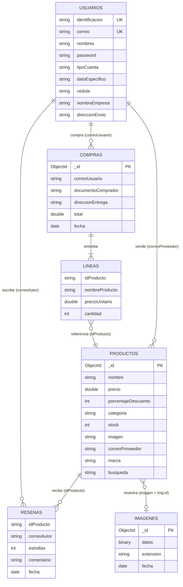
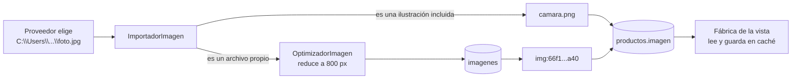

# Esquema de datos NoSQL (MongoDB Atlas)

**Base:** `comercio_electronico` (configurable con `mongodb.base` en
`config.properties`) · **Driver:** `mongodb-driver-sync 5.12.0`

---

## 1. Por qué un modelo de documentos

| Necesidad del dominio | Cómo la resuelve MongoDB |
|---|---|
| Un pedido y sus renglones se leen siempre juntos | Los renglones van **embebidos** en el pedido: una sola lectura, sin `JOIN` |
| El Cliente tiene dirección y el Proveedor tiene NIT y empresa | Documentos de una misma colección con **campos distintos según el rol**, sin columnas vacías |
| Varios equipos comparten el catálogo | *Change Streams* avisan de cada cambio en `productos` (catálogo sincronizado) |
| Descontar stock sin vender dos veces la última unidad | `$inc` con filtro condicional: una operación **atómica** sobre un documento |
| Las imágenes deben verse en cualquier equipo | Se guardan como binario en la colección `imagenes`, no como rutas del disco |

Las colecciones **no se crean a mano**: MongoDB las materializa con el primer
documento. Lo que la aplicación sí declara al arrancar son los índices.

---

## 2. Vista general



> Las relaciones son **referencias lógicas** (por correo o por id), no
> claves foráneas: MongoDB no las impone. La integridad la garantizan los
> casos de uso de `aplicacion.*`.

| Colección | Entidad Java | Adaptador | Repositorio |
|---|---|---|---|
| `usuarios` | `Usuario` → `Cliente` / `Proveedor` | `UsuarioAdapter` | `UsuarioRepositoryMongo` |
| `productos` | `Producto` | `ProductoAdapter` | `ProductoRepositoryMongo` |
| `compras` | `Pedido` + `LineaPedido` | `CompraAdapter` | `PedidoRepositoryMongo` |
| `resenas` | `Resena` | `ResenaAdapter` | `ResenaRepositoryMongo` |
| `imagenes` | (binario) | — | `ImagenRepositoryMongo` |

> **`compras` = pedidos.** En el dominio la entidad se llama `Pedido`; la
> colección conserva el nombre `compras` porque ya tenía datos reales y se
> decidió no migrarlos.

---

## 3. Colección `usuarios`

Una sola colección para los dos roles. El campo `tipoCuenta` dice qué
subclase construir al leer; los campos propios de cada rol solo aparecen en
el documento que los necesita.

| Campo | Tipo | Obligatorio | Descripción |
|---|---|---|---|
| `identificacion` | string | Sí, **único** | Llave de la cuenta; no cambia. En cuentas de Google vale `google-<id>` |
| `nombres` | string | Sí | Nombre visible |
| `correo` | string | Sí, **único** (sin distinguir mayúsculas) | Se guarda tal como lo escribió el usuario |
| `password` | string | Sí | Hash **BCrypt** (`$2a$10$...`). En cuentas de Google, la marca `AUTH_GOOGLE`, que nunca coincide con ninguna contraseña |
| `telefono` | string | No | Se completa desde "Editar perfil" |
| `tipoCuenta` | string | Sí | `"Cliente"` o `"Proveedor"` |
| `datoEspecifico` | string | Sí | Cliente: dirección de envío. Proveedor: **NIT** |
| `cedula` | string | Solo si difiere de `identificacion` | Documento del comprador (5–12 dígitos, no repetido entre cuentas) |
| `nombreEmpresa` | string | Proveedor | **Marca/empresa**: obligatoria para publicar productos |
| `direccionEnvio` | string | Proveedor | El proveedor también compra, así que también tiene dirección |

**Cliente creado con el formulario de registro:**

```json
{
  "identificacion": "1023456789",
  "nombres": "Laura Gómez",
  "correo": "laura.gomez@correo.com",
  "password": "$2a$10$Qm9k...hash BCrypt...",
  "telefono": "3001234567",
  "tipoCuenta": "Cliente",
  "datoEspecifico": "Calle 45 # 12-30, Bogotá"
}
```

**Proveedor (rol doble: vende y compra):**

```json
{
  "identificacion": "79876543",
  "nombres": "Carlos Ruiz",
  "correo": "ventas@tecnoandina.co",
  "password": "$2a$10$Zx81...hash BCrypt...",
  "telefono": "",
  "tipoCuenta": "Proveedor",
  "datoEspecifico": "900123456-7",
  "nombreEmpresa": "TecnoAndina",
  "direccionEnvio": "Carrera 7 # 80-15, Bogotá"
}
```

**Cuenta creada con Google** (perfil incompleto: el sistema avisa en el perfil
y **bloquea el checkout** hasta tener cédula y dirección):

```json
{
  "identificacion": "google-104857392010293847561",
  "nombres": "Ana Torres",
  "correo": "ana.torres@gmail.com",
  "password": "AUTH_GOOGLE",
  "telefono": "",
  "tipoCuenta": "Cliente",
  "datoEspecifico": ""
}
```

**Índices:**

| Índice | Definición | Para qué |
|---|---|---|
| `identificacion_1` | `{identificacion: 1}`, único | Una cuenta por identificación |
| `correo_1` | `{correo: 1}`, único, colación `{locale: "es", strength: 2}` | Un correo por cuenta, sin distinguir mayúsculas. Cierra la carrera de dos registros simultáneos |

La **misma colación** se usa en las búsquedas por correo: si el índice y la
consulta compararan distinto, la aplicación diría "correo libre" y la base
rechazaría la inserción.

---

## 4. Colección `productos`

| Campo | Tipo | Descripción |
|---|---|---|
| `_id` | ObjectId | Asignado por MongoDB |
| `nombre`, `descripcion` | string | Texto visible |
| `precio` | double | Precio de lista (> 0) |
| `porcentajeDescuento` | int | 0–100. Alimenta el banner y el pop-up promocional |
| `categoria` | string | `TECNOLOGIA`, `CALZADO`, `HOGAR`, `MODA`, `DEPORTE` (nombre del `enum Categoria`) |
| `stock` | int | Existencias; nunca baja de 0 |
| `imagen` | string | **Referencia portable** (ver §7): `camara.png`, `img:<id>` o una URL `https://` (los productos de demostración usan Unsplash con `?fm=jpg`: Java no lee WebP ni AVIF) |
| `correoProveedor` | string | Dueño del producto |
| `marca` | string | Empresa del proveedor ("Vendido por TecnoAndina"). Se copia al publicar para no consultar `usuarios` en cada lectura del catálogo |
| `busqueda` | string | Nombre + descripción en minúsculas y **sin tildes**: así "cafe" encuentra "Café" |

```json
{
  "_id": { "$oid": "66f1a2b3c4d5e6f708192a3b" },
  "nombre": "Cámara Mirrorless 24MP",
  "descripcion": "Sensor APS-C, video 4K y estabilización.",
  "precio": 2899000.0,
  "porcentajeDescuento": 15,
  "categoria": "TECNOLOGIA",
  "stock": 7,
  "imagen": "img:66f1a2b3c4d5e6f708192a40",
  "correoProveedor": "ventas@tecnoandina.co",
  "marca": "TecnoAndina",
  "busqueda": "camara mirrorless 24mp sensor aps-c, video 4k y estabilizacion."
}
```

**Operaciones relevantes:**

| Operación | Consulta | Garantía |
|---|---|---|
| Descontar stock en una compra | `updateOne({_id, stock: {$gte: n}}, {$inc: {stock: -n}})` | **Atómica**: si no alcanza, no modifica nada y la compra se cancela |
| Reponer stock (compensación) | `updateOne({_id}, {$inc: {stock: n}})` | Devuelve lo ya descontado si otro renglón falla |
| Buscar | `regex` sobre `busqueda` + `eq` sobre `categoria` | El texto se normaliza con la misma función que guardó el campo |
| Cambio de empresa o correo del proveedor | `updateMany({correoProveedor}, {$set: {correoProveedor, marca}})` | Ningún producto queda huérfano |
| Catálogo sincronizado | `productos.watch()` (*Change Stream*) | Hilo `vigilante-catalogo`; avisa a las tiendas abiertas en todos los equipos |

---

## 5. Colección `compras` (pedidos)

Los renglones van **embebidos**: un pedido nunca se lee sin ellos, y guardan
el nombre y el precio **del momento de la compra** (si mañana cambia el
precio del producto, el pedido histórico no cambia).

| Campo | Tipo | Descripción |
|---|---|---|
| `_id` | ObjectId | Número de pedido |
| `correoUsuario`, `nombreUsuario` | string | Comprador |
| `documentoComprador` | string | Cédula exigida antes de comprar |
| `direccionEntrega` | string | Dirección exigida antes de comprar |
| `total` | double | Suma de los renglones |
| `fecha` | date | Momento de la confirmación |
| `lineas[]` | array | `{idProducto, nombreProducto, precioUnitario, cantidad}` |

```json
{
  "_id": { "$oid": "66f2c0d1e2f3a4b5c6d7e8f9" },
  "correoUsuario": "laura.gomez@correo.com",
  "nombreUsuario": "Laura Gómez",
  "documentoComprador": "1023456789",
  "direccionEntrega": "Calle 45 # 12-30, Bogotá",
  "total": 2643150.0,
  "fecha": { "$date": "2026-09-28T15:42:10Z" },
  "lineas": [
    { "idProducto": "66f1a2b3c4d5e6f708192a3b", "nombreProducto": "Cámara Mirrorless 24MP",
      "precioUnitario": 2464150.0, "cantidad": 1 },
    { "idProducto": "66f1a2b3c4d5e6f708192a55", "nombreProducto": "Tenis Running Pro",
      "precioUnitario": 179500.0, "cantidad": 1 }
  ]
}
```

Este historial se usa para tres cosas: la pantalla "Mis compras", los
indicadores del panel del vendedor (ingresos, unidades, ticket promedio,
producto más vendido) y **la validación de reseñas**.

---

## 6. Colección `resenas`

| Campo | Tipo | Regla |
|---|---|---|
| `idProducto` | string | Producto reseñado |
| `correoAutor`, `nombreAutor` | string | Autor |
| `estrellas` | int | **1 a 5** |
| `comentario` | string | Opcional, **máximo 300** caracteres |
| `fecha` | date | Última edición |

```json
{
  "idProducto": "66f1a2b3c4d5e6f708192a3b",
  "correoAutor": "laura.gomez@correo.com",
  "nombreAutor": "Laura Gómez",
  "estrellas": 5,
  "comentario": "Llegó rápido y la calidad de imagen es excelente.",
  "fecha": { "$date": "2026-09-30T20:11:45Z" }
}
```

**Reglas de negocio** (`aplicacion.resena.ResenaService`):

1. **Solo quien lo compró:** antes de guardar se recorre el historial de
   `compras` del autor buscando el `idProducto`. Sin compra, no hay reseña.
2. **Nunca el vendedor:** si `correoAutor` es el `correoProveedor` del
   producto, se rechaza (nadie se califica a sí mismo).
3. **Una por persona y producto:** índice único
   `{idProducto: 1, correoAutor: 1}`. Una reseña nueva **reemplaza** la
   anterior (*upsert*).
4. **Promedio calculado en la base:** `$group` con `$avg` y `$sum`; viajan
   unas pocas cifras, no todas las reseñas. Las estrellas (con media estrella)
   se dibujan en la tarjeta y en la ficha del producto.

---

## 7. Colección `imagenes` (imágenes en la nube)

| Campo | Tipo | Descripción |
|---|---|---|
| `_id` | ObjectId | Se referencia desde `productos.imagen` como `img:<_id>` |
| `datos` | Binary | Imagen reducida a **800 px** como máximo (PNG si tiene transparencia, JPG si no) |
| `extension` | string | `png` o `jpg` |
| `fecha` | date | Momento de la subida |

**Flujo de una imagen:**



- **En la base nunca se guarda una ruta del disco.** Una ruta
  `C:\Users\...` no existe en el equipo del compañero ni dentro del `.exe`.
- La vista no conoce el repositorio: `app.Main` le entrega a la fábrica la
  función `imagenes::leer`, y la fábrica guarda en memoria lo ya leído.
- Rutas antiguas: `NormalizacionCatalogo` las convierte al arrancar, en
  segundo plano y sin repetir trabajo (idempotente).
- El límite de 16 MB por documento de MongoDB no es un problema: una imagen
  de 800 px pesa entre 50 y 300 KB.

---

## 8. Reglas de evolución del esquema

| Regla | Motivo |
|---|---|
| Los campos nuevos solo se escriben si tienen valor (`cedula`, `marca`, `documentoComprador`) | Un documento sin ellos sale idéntico al de antes, y los documentos antiguos se siguen leyendo |
| Un repositorio nunca escribe un nombre de campo en texto: usa las constantes `CAMPO_*` del adaptador | La consulta y el documento no pueden desincronizarse |
| Renombrar un campo = migrar datos | Los documentos ya guardados en Atlas dejarían de leerse. La refactorización a adaptadores se verificó comparando byte a byte 10 conversiones contra el código anterior |
| Las contraseñas llegan ya cifradas al repositorio | El repositorio es acceso a datos; BCrypt vive solo en `CifradoPassword` |

---

## 9. Conexión y respaldo

- **Cadena de conexión:** `mongodb.uri` en `config.properties` (archivo en
  `.gitignore`; se entrega `config.properties.ejemplo` como plantilla). Nunca
  en el código.
- **Arranque:** `ping` con 8 s de espera. El driver conecta de forma perezosa;
  sin el `ping`, el primer fallo aparecería en mitad de un registro.
- **Sin Atlas la aplicación funciona igual:** si falta el archivo o el
  clúster no responde, se usan los repositorios en memoria
  (`model.repository.memoria`) y se avisa por consola. Los datos de esa
  sesión se pierden al cerrar.
- **Rendimiento medido:** 3,5 s la primera conexión y ~100 ms por consulta
  desde Colombia. Por eso toda operación con la base corre en segundo plano
  (`SwingWorker`) y la ventana nunca se congela.
- **Recomendaciones de operación** (ver la matriz de riesgos):
  usuario de base con permisos solo de lectura/escritura sobre
  `comercio_electronico`, lista de IP permitidas en *Network Access* y una
  exportación previa a la sustentación con `mongodump`.
