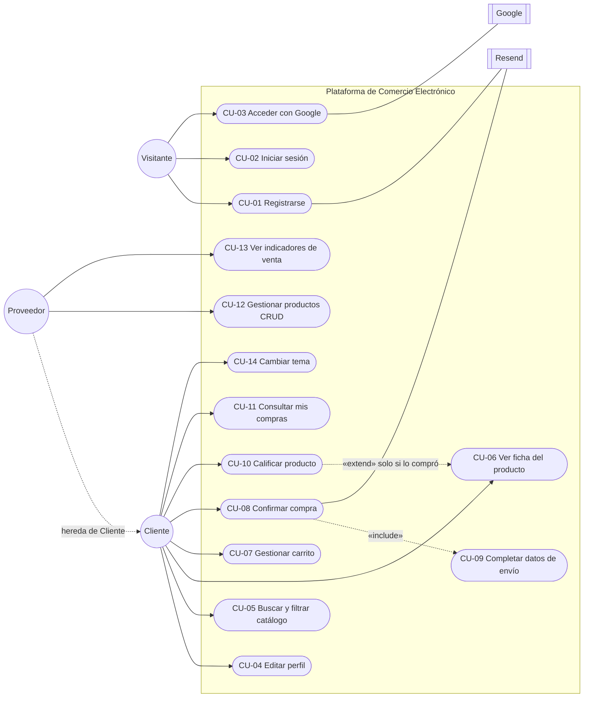
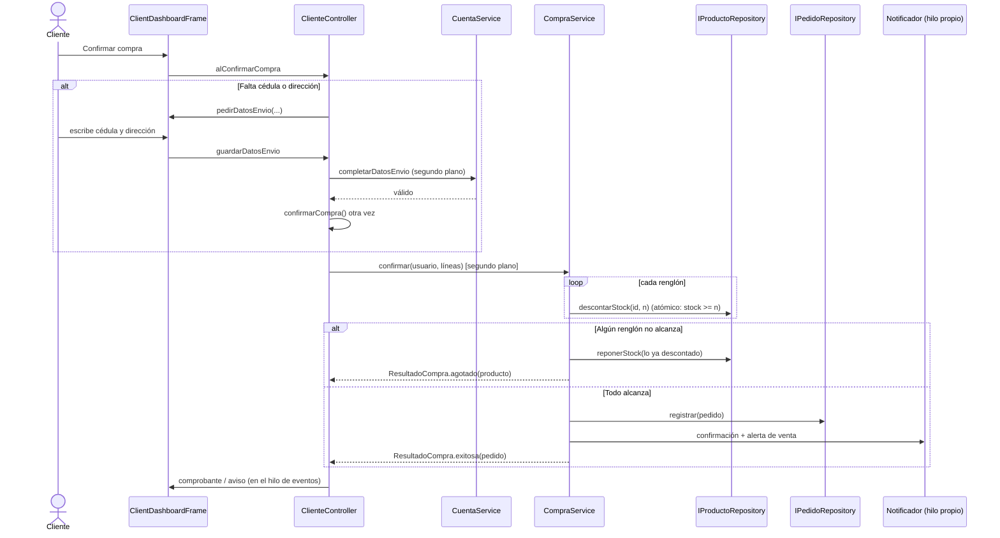

# Casos de uso y pruebas

---

## 1. Actores

| Actor | Descripción |
|---|---|
| **Visitante** | Persona sin sesión: puede registrarse o iniciar sesión |
| **Cliente** | Cuenta que compra |
| **Proveedor** | Cuenta que **vende y también compra** (doble rol). Hereda todo lo del Cliente |
| **Google** | Sistema externo que confirma la identidad (OAuth 2.0) |
| **MongoDB Atlas** | Sistema externo de persistencia compartida |
| **Resend** | Sistema externo de envío de correos |

---

## 2. Diagrama de casos de uso

> CU-09 se **incluye** en CU-08 cuando a la cuenta le faltan la cédula o la
> dirección (caso típico de una cuenta creada con Google).

---

## 3. Especificación de casos de uso principales

### CU-03 · Acceder con Google

| Campo | Detalle |
|---|---|
| Actor | Visitante, Google |
| Precondición | `google.client.id` y `google.client.secret` configurados (si no, el botón no aparece) |
| Flujo principal | 1. Pulsa "Continuar con Google". 2. Se abre el navegador con la página de Google. 3. El usuario autoriza. 4. Google devuelve el código a `127.0.0.1:<puerto>`. 5. El sistema canjea el código (PKCE) y obtiene el correo **verificado**. 6. Si la cuenta existe, entra a la tienda |
| Flujo alterno A | 6a. Correo nuevo: el sistema pregunta el rol (Cliente/Proveedor) y crea la cuenta **sin cédula ni dirección** |
| Flujo alterno B | El usuario cierra la pestaña: pulsa "Cancelar" en la espera y vuelve al Login sin error |
| Postcondición | Sesión abierta. Si faltan datos, el perfil muestra un aviso |

### CU-08 · Confirmar compra (con CU-09 incluido)

| Campo | Detalle |
|---|---|
| Actor | Cliente (o Proveedor comprando) |
| Precondición | Sesión abierta y carrito con al menos un producto |
| Flujo principal | 1. Pulsa "Confirmar compra". 2. El sistema verifica que la cuenta tenga cédula y dirección. 3. Descuenta el stock de cada renglón de forma atómica. 4. Registra el pedido. 5. Envía correo al comprador y a la tienda. 6. Vacía el carrito y muestra el comprobante |
| Flujo alterno A (CU-09) | 2a. Faltan datos: se abre un formulario rápido de cédula y dirección. No se cierra hasta que los datos son válidos; al guardarlos, **la compra continúa sola** |
| Flujo alterno B | 3a. Un producto ya no alcanza: se devuelve el stock ya descontado, no se registra el pedido y se informa qué producto faltó. El carrito se conserva |
| Postcondición | Pedido en `compras`, stock descontado, correos encolados |

### CU-10 · Calificar producto

| Campo | Detalle |
|---|---|
| Actor | Cliente |
| Precondición | El usuario **compró** el producto y **no es su vendedor** |
| Flujo principal | 1. Abre la ficha del producto. 2. Elige de 1 a 5 estrellas y escribe un comentario opcional. 3. Pulsa "Publicar". 4. El sistema valida y guarda. 5. La ficha muestra el nuevo promedio |
| Flujos alternos | Sin compra: el formulario no se ofrece y se lee "Podrás calificarlo cuando lo hayas comprado". Producto propio: "Es un producto de tu tienda…". Sin estrellas: "Elige de 1 a 5 estrellas." Comentario > 300: se rechaza |
| Postcondición | Una sola reseña por persona y producto (la nueva reemplaza la anterior) |

### CU-12 · Gestionar productos (CRUD)

| Campo | Detalle |
|---|---|
| Actor | Proveedor |
| Precondición | La cuenta tiene **nombre de empresa** (si no, "Gestionar tienda" abre primero el perfil) |
| Flujo principal | Crear: llena el formulario (nombre, descripción, precio, descuento, categoría, stock, imagen) → el sistema valida, sube la imagen a la nube, guarda con la marca y avisa a las tiendas abiertas. Editar y eliminar desde la tabla |
| Validaciones | Nombre obligatorio, precio numérico > 0 (acepta coma decimal), descuento 0–100, stock ≥ 0 |
| Postcondición | El catálogo de todos los compradores conectados se actualiza solo (Observer) |

---

## 4. Estrategia de pruebas

| Nivel | Qué se prueba | Herramienta |
|---|---|---|
| **Reglas de negocio** (automatizado) | Casos de uso de `aplicacion.*` con repositorios en memoria y notificadores falsos | 8 programas `Verificacion*` en `test/aplicacion` |
| **Persistencia** (automatizado) | Formato de los documentos de MongoDB, sin conectarse | `test/model/.../VerificacionUsuarioAdapter` |
| **Controladores** (automatizado) | Flujo del controlador con una vista falsa, sin abrir ventanas | `test/controller/VerificacionClienteController` |
| **Fábrica de la vista** (automatizado) | Conmutador de tema con colores vivos | `test/view/factory/VerificacionConmutadorTema` |
| **Interfaz** (visual) | Ventanas reales, en los dos temas | Capturas con `java.awt.Robot` |
| **Funcional** (manual) | Casos de prueba de la §6, ejecutados sobre la aplicación | Checklist de este documento |

> Las pruebas automáticas **nunca escriben en Atlas**: usan los repositorios
> en memoria, para no tocar los datos reales compartidos del equipo.

---

## 5. Pruebas automatizadas

### 5.1 Cómo ejecutarlas

En NetBeans, abre cualquier archivo `Verificacion*.java` de la carpeta
*Test Packages* y usa clic derecho → **Run File** (`Shift + F6`). Cada
programa imprime una línea por comprobación y al final `TODO CORRECTO`, o
termina con código de error indicando cuál falló. Son programas Java puros,
sin JUnit, porque el proyecto no tiene esa dependencia.

### 5.2 Resultado de la última ejecución (04/10/2026)

| Programa | Paquete | Comprobaciones | Resultado |
|---|---|---|---|
| `VerificacionAutenticacionService` | `aplicacion.acceso` | 13 | TODO CORRECTO |
| `VerificacionCatalogoService` | `aplicacion.catalogo` | 22 | TODO CORRECTO |
| `VerificacionImagenesPortables` | `aplicacion.catalogo` | 9 | TODO CORRECTO |
| `VerificacionCompraService` | `aplicacion.compra` | 10 | TODO CORRECTO |
| `VerificacionCompraConcurrente` | `aplicacion.compra` | 1 (20 rondas) | TODO CORRECTO |
| `VerificacionCuentaService` | `aplicacion.cuenta` | 20 | TODO CORRECTO |
| `VerificacionDobleRol` | `aplicacion.cuenta` | 13 | TODO CORRECTO |
| `VerificacionResenaService` | `aplicacion.resena` | 9 | TODO CORRECTO |
| `VerificacionClienteController` | `controller` | 17 | TODO CORRECTO |
| `VerificacionUsuarioAdapter` | `model.repository.mongo.adapter` | 4 | TODO CORRECTO |
| `VerificacionConmutadorTema` | `view.factory` | 5 | TODO CORRECTO |
| **Total: 11 programas** | | **123** | **123/123** |

### 5.3 Detalle de lo que verifican

**Autenticación** — pide los dos campos; acepta la contraseña comparando
contra el hash BCrypt; reconoce el correo sin distinguir mayúsculas; avisa que
una cuenta de Google entra con Google; escribir la marca `AUTH_GOOGLE` como
contraseña no entra; avisa de los intentos restantes (2, luego 1); el tercer
fallo bloquea 30 s; tras el bloqueo se puede reintentar; un acceso correcto
reinicia el contador; cada pantalla de acceso lleva su propio contador;
reconoce a quien vuelve de Google.

**Catálogo (CRUD)** — rechaza nombre vacío, precio no numérico, descuento de
120 y stock negativo, sin guardar ni avisar; publica y acepta precio con coma
decimal; avisa al catálogo una vez por alta (Observer); edita; editar con
datos inválidos no toca lo guardado; elimina; eliminar dos veces y editar algo
borrado avisan en vez de fallar; el reporte de ventas suma solo los renglones
propios, cuenta pedidos correctamente, excluye otros proveedores, calcula el
ticket promedio y el producto estrella, y funciona sin pedidos ni catálogo.

**Imágenes portables** — una ruta absoluta se convierte en `img:<id>`; la
imagen guardada se reduce a 800 px; una ilustración incluida se conserva por
su nombre, aunque venga con la ruta de otro equipo; una ruta inexistente se
rechaza al publicar; la normalización de arranque corrige rutas antiguas y
completa marcas, no deja ninguna ruta local y una segunda pasada no cambia
nada; cambiar correo y empresa del proveedor mueve sus productos.

**Compra** — registra el pedido; descuenta la cantidad exacta; usa la
dirección de la cuenta; avisa al comprador y a la tienda; si falta un
producto, dice cuál, devuelve el stock ya descontado y no registra pedido ni
envía correos; si falla el registro del pedido, el stock vuelve entero;
historial por correo.

**Compra concurrente** — en 20 rondas, dos hilos compran a la vez la última
unidad: en cada ronda compra exactamente uno, el stock queda en 0 y hay un
solo pedido.

**Cuenta** — rechaza identificación con letras, correo mal formado y
contraseña fuera de política, sin crear cuentas; un registro válido crea la
cuenta con la contraseña **cifrada** y envía la bienvenida; rechaza correo e
identificación repetidos; el alta con Google crea la cuenta con el rol elegido
e identificación `google-<id>` y no admite duplicados; la edición de perfil
rechaza nombre vacío, teléfono corto y correo de otra cuenta, acepta conservar
el propio, exige la contraseña actual para cambiarla y no deja poner
contraseña a una cuenta de Google.

**Doble rol y datos de envío** — el registro de Proveedor exige la empresa y
con ella puede vender; el Cliente no necesita empresa ni vende; la cédula de
una cuenta de formulario es su identificación; una cuenta de Google nace sin
datos de envío y el perfil lo avisa; su compra se rechaza sin tocar el stock;
se rechazan cédula con puntos, cédula de otra cuenta y dirección demasiado
corta; con datos válidos compra y el pedido lleva su cédula y dirección; el
Proveedor sin dirección propia tampoco compra.

**Reseñas** — quien no compró no puede reseñar y quien compró sí; el vendedor
no reseña lo suyo; se rechazan 0 y 6 estrellas y un comentario de 301
caracteres; se acepta uno de 300; una segunda reseña reemplaza a la primera;
el resumen del catálogo da promedio y cantidad.

**Controlador de la tienda** (vista falsa) — en una cuenta de Google,
confirmar pide el formulario de datos y no compra; una cédula inválida deja
el formulario abierto con el error; con datos válidos se cierra y la compra
sigue sola; la ficha llega con permiso para opinar si lo compró, o con el
motivo si no; sin estrellas muestra el error en la ficha; al publicar se
actualizan la sección y la tarjeta del catálogo; el pop-up solo ofrece
productos con descuento y existencias, sale cerca del 40 % de los accesos
(810 de 2000 en la última ejecución) y nunca al reconstruir la tienda en la
misma sesión; el banner lleva las 4 mejores ofertas ordenadas; sin descuentos
no hay pop-up ni banner; las cantidades del carrito respetan el stock y 0
quita el renglón.

**Formato de documentos** (sin conectarse a Atlas) — un Cliente de formulario
sigue produciendo sus 7 campos de siempre; un Proveedor guardado antes de la
empresa se sigue leyendo; la cédula de una cuenta de Google y la empresa,
dirección y NIT del Proveedor viajan en el documento.

**Conmutador de tema** — arranca en claro; al alternar pasa a oscuro e
instala `FlatDarkLaf`; el mismo objeto `Color` ya entregado por la fábrica da
el fondo nuevo (por eso no hace falta cerrar ventanas); vuelve a claro.

### 5.4 Verificaciones visuales

La interfaz se comprueba con 27 capturas de `java.awt.Robot` sobre las
ventanas reales, que recorren acceso, registro, tienda, pop-up, ficha con
reseñas, carrito, checkout bloqueado, panel del vendedor y tema oscuro. Están,
con lo que demuestra cada una y los defectos que destaparon, en
**[evidencias_de_pruebas.md](evidencias_de_pruebas.md)**. Las genera
`test/manual/CapturasDocumentacion.java`; no son automatizables con un
`TODO CORRECTO`: se revisan mirándolas.

---

## 6. Casos de prueba funcionales

Formato: **ID · Precondición · Pasos · Resultado esperado**. La columna
*Resultado* recoge la ejecución del 04/10/2026: **31 pasan** (con captura en
[evidencias_de_pruebas.md](evidencias_de_pruebas.md) o con una verificación
automática) y **7 quedan pendientes** de ejecutar a mano. Cuatro de los que
pasan destaparon un defecto de presentación (H-01 a H-04), ya corregido y
vuelto a fotografiar (ver §8 de las evidencias).

### 6.1 CRUD de productos (Proveedor)

| ID | Precondición | Pasos | Resultado esperado | Resultado |
|---|---|---|---|---|
| CP-01 | Proveedor con empresa | Nuevo producto → datos válidos con imagen propia → Guardar | Aparece en la tabla y en la tienda con "Vendido por <empresa>" y su imagen | Pasa (captura 24; sin imagen propia) |
| CP-02 | Ídem | Precio `abc` | "El precio debe ser un número mayor que cero." y no se guarda | Pasa (hallazgo H-01 corregido; captura 23) |
| CP-03 | Ídem | Descuento `120` | "El descuento debe ser un número entre 0 y 100." | Pasa (automática) |
| CP-04 | Ídem | Stock `-1` | "El stock debe ser un número de cero en adelante." | Pasa (automática) |
| CP-05 | Producto existente | Editar precio y stock → Guardar | La tabla y la tienda muestran los nuevos valores | Pasa (automática) |
| CP-06 | Producto existente | Eliminar → confirmar | Desaparece de la tabla y de la tienda | Pasa (automática) |
| CP-07 | Proveedor **sin** empresa (cuenta de Google) | Avatar → Gestionar tienda | Abre el perfil con el aviso de empresa; no deja publicar hasta completarla | Pendiente |
| CP-08 | Dos equipos con Atlas | Equipo A publica un producto | La tienda abierta en el equipo B lo muestra sin recargar | Pendiente: requiere dos equipos con Atlas |
| CP-09 | Imagen subida en equipo A | Abrir la tienda en el equipo B (o en el `.exe`) | La imagen se ve igual | Pendiente: requiere dos equipos con Atlas |

### 6.2 Validación de perfil de Google y bloqueo del checkout

| ID | Precondición | Pasos | Resultado esperado | Resultado |
|---|---|---|---|---|
| CP-10 | Cuenta nueva de Google | Iniciar con Google → elegir Cliente | Entra a la tienda; la cuenta no tiene cédula ni dirección | Pasa (automática, con Google simulado) |
| CP-11 | Ídem | Avatar → Editar perfil | Aviso arriba: faltan cédula y dirección | Pasa (captura 16) |
| CP-12 | Ídem, carrito con un producto | Confirmar compra | **No compra**: abre el formulario rápido de cédula y dirección | Pasa (captura 17) |
| CP-13 | Formulario rápido abierto | Cédula `12ab` | Mensaje de formato (5–12 dígitos); el formulario sigue abierto con lo escrito | Pasa (hallazgo H-03 corregido; captura 18) |
| CP-14 | Ídem | Cédula ya usada por otra cuenta | "Esa cédula ya está registrada en otra cuenta."; no se guarda | Pasa (automática) |
| CP-15 | Ídem | Cédula y dirección válidas → Guardar | El formulario se cierra y **la compra continúa sola** hasta el comprobante | Pasa (captura 19) |
| CP-16 | Cuenta de Google | Login con su correo y la contraseña `AUTH_GOOGLE` | No entra: "Esta cuenta entra con Google. Usa el botón de Google." | Pasa (automática) |

### 6.3 Carrito y compra

| ID | Precondición | Pasos | Resultado esperado | Resultado |
|---|---|---|---|---|
| CP-17 | Producto con stock 3 | Agregar 2 al carrito | Badge del carrito = 2; renglón con miniatura, precio unitario y subtotal | Pasa (captura 13) |
| CP-18 | Ídem | En el carrito, pulsar "+" hasta 4 | No pasa de 3 / "Solo quedan 3 unidades" | Pasa (automática) |
| CP-19 | Renglón con cantidad 1 | Pulsar "−" | El renglón desaparece; el total se recalcula | Pasa (automática) |
| CP-20 | Carrito con 2 productos, datos completos | Confirmar compra | Comprobante, stock descontado, carrito vacío, correo de confirmación y alerta de venta | Pasa (captura 14 y correos) |
| CP-21 | Otro comprador acaba de agotar un producto del carrito | Confirmar compra | "No hay unidades suficientes de X."; **ningún** stock se descuenta; el carrito se conserva | Pasa (automática) |
| CP-22 | Compra realizada | Avatar → Mis compras | El pedido aparece con fecha, total y productos | Pasa (hallazgo H-04 corregido; captura 15) |
| CP-23 | Carrito vacío | Confirmar compra | "Tu carrito está vacío." | Pendiente |

### 6.4 Reseñas con estrellas

| ID | Precondición | Pasos | Resultado esperado | Resultado |
|---|---|---|---|---|
| CP-24 | Producto **no** comprado | Abrir su ficha | No se ofrece el formulario: "Podrás calificarlo cuando lo hayas comprado." | Pasa (captura 12) |
| CP-25 | Producto comprado | Elegir 4 estrellas + comentario → Publicar | La reseña aparece; el promedio y el número de reseñas se actualizan en la ficha y en la tarjeta | Pasa (hallazgo H-02 corregido; captura 11) |
| CP-26 | Ídem | Publicar sin elegir estrellas | "Elige de 1 a 5 estrellas." | Pasa (automática) |
| CP-27 | Ídem | Comentario de 301 caracteres | Se rechaza (máximo 300) | Pasa (automática) |
| CP-28 | Ya reseñó con 4 | Publicar de nuevo con 2 | Reemplaza la anterior: sigue habiendo **una** reseña suya | Pasa (automática) |
| CP-29 | Proveedor viendo su propio producto | Abrir la ficha | No puede reseñar: "Es un producto de tu tienda…" | Pasa (captura 27) |
| CP-30 | Cualquiera | Comentario con `` | Se muestra como texto, no se carga ninguna imagen | Pendiente |

### 6.5 Acceso, sesión y tema

| ID | Precondición | Pasos | Resultado esperado | Resultado |
|---|---|---|---|---|
| CP-31 | Cuenta existente | 3 contraseñas incorrectas seguidas | Bloqueo con cuenta regresiva de 30 s | Pasa (capturas 02 y 03) |
| CP-32 | Registro | Contraseña `abc` | Semáforo en rojo y registro rechazado | Pasa (captura 04) |
| CP-33 | Registro | Correo existente con otras mayúsculas | "Este correo ya está registrado en el sistema." | Pasa (automática) |
| CP-34 | Sesión abierta | Cerrar con la X y volver a abrir | Entra directo a la tienda (sesión recordada) | Pendiente |
| CP-35 | Sesión abierta | Avatar → Cerrar sesión, reabrir | Muestra el Login | Pendiente |
| CP-36 | Tienda con carrito y búsqueda escrita | Cambiar a modo oscuro | Fundido sin cerrar la ventana; carrito y búsqueda intactos | Pasa (capturas 25 a 27) |
| CP-37 | Proveedor en la tienda | Avatar → Gestionar tienda → Ir a la tienda | Pasa al panel y vuelve; el carrito se conserva | Pasa (capturas 20 y 21) |
| CP-38 | Sin internet | Abrir la aplicación | Arranca con el almacén en memoria y avisa por consola | Pasa (.exe contra un servidor inexistente) |
