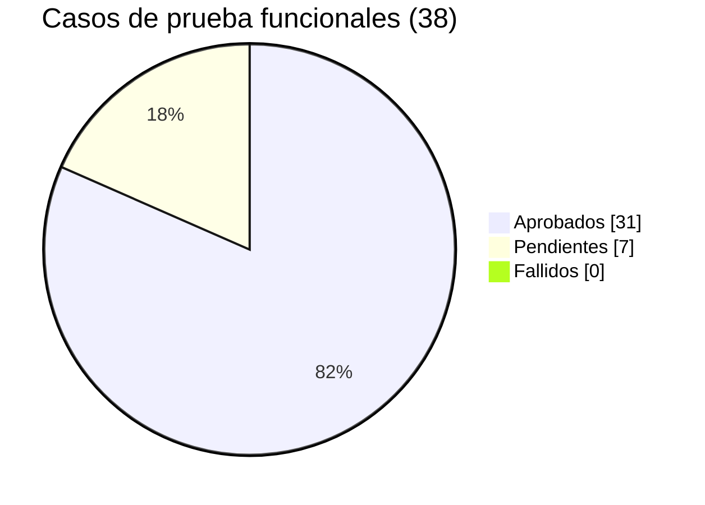
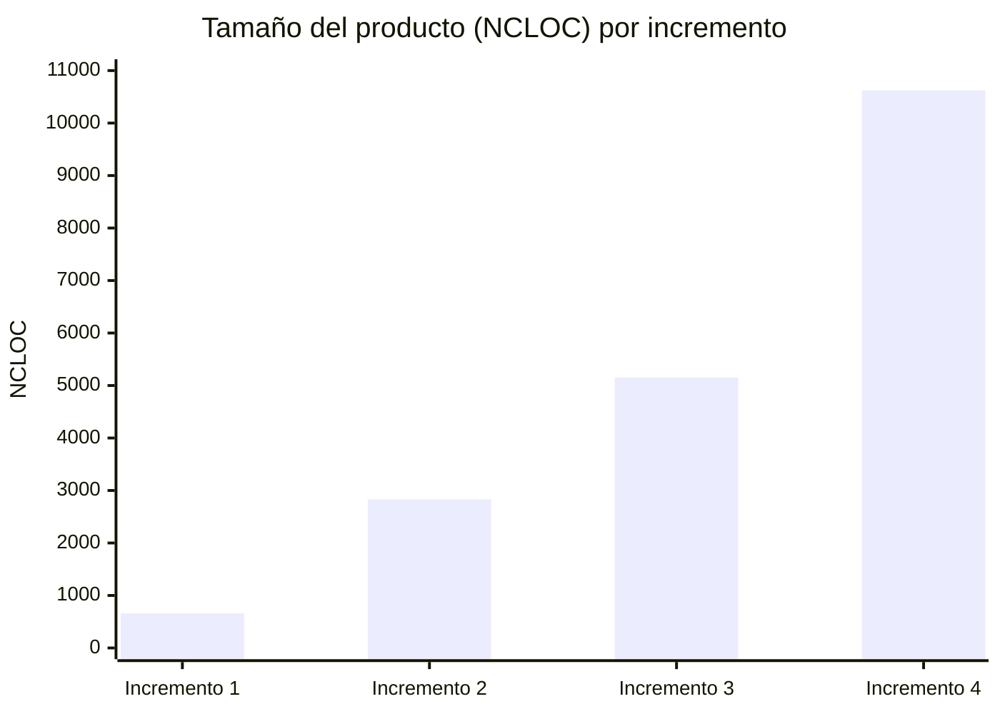

# Métricas del proyecto

**Proyecto:** Plataforma de Comercio Electrónico (Java 26 + Swing) ·
**Fecha de medición:** 05/10/2026 · **Equipo:** Guillermo Luis Sandoval
Ricardo, Sebastian Uparela, Juan Guillerme Noble · **Asignatura:** Ingeniería
del Software II, Unidad 3

> Gestionar riesgos permite decidir qué proteger y qué controlar; **medir
> permite comprobar qué está ocurriendo con el proyecto.** Este documento
> mide el producto en sus cuatro incrementos, con las mismas reglas, y
> relaciona cada medida con una decisión o con un riesgo de
> [requisitos_y_riesgos.md](../03_Gestion_y_Requisitos/requisitos_y_riesgos.md).

---

## Resumen de avance

Las tres preguntas que resumen el estado del proyecto: ¿se hizo el trabajo
planificado?, ¿funciona lo que se pidió? y ¿está probado?

| Métrica | Fórmula | Valor | Avance | Estado |
|---|---|---|---|---|
| **Tareas completadas en Trello** | Tarjetas en "Hecho" / tarjetas asignadas | 25 / 25 | **100 %** | 🟢 |
| **Requisitos funcionales implementados** | RF implementados / RF definidos | 27 / 27 | **100 %** | 🟢 |
| **Casos de prueba funcionales aprobados** | Casos aprobados / casos diseñados | 31 / 38 | **81,6 %** | 🟡 |
| Casos de prueba fallidos | Casos fallidos / casos ejecutados | 0 / 31 | 0 % | 🟢 |
| **Comprobaciones automáticas superadas** | Comprobaciones "OK" / comprobaciones | 123 / 123 | **100 %** | 🟢 |

**Lectura.** Todo el trabajo planificado está terminado y todos los
requisitos están implementados. Las pruebas automáticas pasan completas. De
los casos funcionales, ninguno falló: los 7 restantes **no se han
ejecutado todavía** (CP-07, CP-23, CP-30, CP-34 y CP-35 se pueden ejecutar
en un solo equipo; CP-08 y CP-09 necesitan dos equipos conectados a Atlas).
El detalle de cada caso está en
[documentacion_pruebas.md](../04_Pruebas_y_Casos/documentacion_pruebas.md).

---

## 1. Marco de medición utilizado

| Estándar o método | Qué tomamos de él | Dónde se aplica |
|---|---|---|
| **GQM** (*Goal–Question–Metric*, Basili) | Cada métrica nace de un objetivo y responde una pregunta. No se mide nada "por si acaso" | §3, siete objetivos |
| **ISO/IEC 15939** y **PSM** (*Practical Software Measurement*) | El proceso: necesidad de información → concepto medible → medida base → medida derivada → indicador → criterio de decisión. De PSM, las categorías de información: *tamaño y estabilidad del producto*, *calidad del producto* y *cronograma y progreso* | §2 (ejemplo completo), §4 y §7 |
| **ISO/IEC 25010** (familia **ISO/IEC 25000**, SQuaRE) | El modelo de calidad del producto: cada objetivo apunta a una característica (mantenibilidad, fiabilidad, eficiencia de desempeño, seguridad, portabilidad, usabilidad, adecuación funcional) | Columna "ISO 25010" de §3 |
| **CMMI**, área de proceso *Medición y Análisis* (MA) | Las prácticas: establecer objetivos, especificar medidas y procedimientos, recolectar, analizar, almacenar y comunicar | §8 |
| **IEEE Std 1061** (metodología de métricas de calidad) | Que cada métrica tenga un umbral explícito y una decisión asociada, no solo un valor | Columna "Criterio" de §3 |

El equipo **no** es una organización evaluada en CMMI: alineamos las
prácticas de MA a la escala de un proyecto académico.

---

## 2. Ejemplo completo del proceso ISO/IEC 15939

Así se construyó cada indicador. El de la arquitectura, paso a paso:

| Elemento (ISO/IEC 15939) | En nuestro proyecto |
|---|---|
| **Necesidad de información** | ¿La arquitectura MVC sigue siendo mantenible a medida que el sistema crece? |
| **Concepto medible** | Respeto de las reglas de dependencia entre capas y tamaño de las clases |
| **Entidad y atributo** | Cada archivo `.java`: sus `import` y sus líneas de código |
| **Medidas base** | (a) Archivos de `view` que importan `model`; (b) archivos de `model` que importan Swing/AWT; (c) controladores que importan un repositorio concreto; (d) NCLOC de cada archivo |
| **Medidas derivadas** | Total de violaciones = a + b + c; porcentaje de archivos con más de 400 NCLOC |
| **Indicador** | Semáforo de mantenibilidad |
| **Criterio de decisión** | Violaciones = 0 → verde; cualquier violación → rojo y se corrige antes de cerrar el incremento. Archivos > 400 NCLOC ≤ 5 % → verde |
| **Resultado (Incremento 4)** | 0 violaciones; 3 de 140 archivos (2,1 %) superan 400 NCLOC → **verde**, con 3 clases vigiladas (ver §5) |

---

## 3. Objetivos, preguntas y métricas (GQM)

Leyenda: **I1…I4** = Incremento 1…4. 🟢 cumple · 🟡 vigilar · 🔴 actuar.

### G1 — Mantener una arquitectura que se pueda modificar sin romperla

*ISO 25010: Mantenibilidad (modularidad, analizabilidad, modificabilidad) · PSM: calidad del producto*

| Pregunta | Métrica | I1 | I2 | I3 | I4 | Criterio | Estado |
|---|---|---|---|---|---|---|---|
| ¿Se respeta la separación MVC? | Archivos de `view` que importan `model` | 0 | 0 | 0 | 0 | = 0 | 🟢 |
| | Archivos de `model` que importan Swing/AWT | 0 | 0 | 0 | 0 | = 0 | 🟢 |
| | Controladores que importan un repositorio concreto | 0 | 0 | 0 | 0 | = 0 | 🟢 |
| ¿Se distingue el rol con polimorfismo y no con `instanceof`? | `instanceof` en `model`, `aplicacion` y `controller` (sin comentarios) | 0 | 0 | 0 | 0 | = 0 | 🟢 |
| ¿Las clases tienen un tamaño manejable? | NCLOC promedio por archivo | 82,2 | 83,3 | 83,1 | 75,9 | ≤ 150 | 🟢 |
| | Archivos con más de 400 NCLOC | 0 | 1 | 2 | 3 | ≤ 5 % del total | 🟡 |
| ¿El código se puede entender? | Clases públicas con Javadoc | 100 % | 100 % | 100 % | 100 % | ≥ 90 % | 🟢 |
| | Densidad de comentarios (comentario / (comentario + código)) | 39,6 % | 39,7 % | 36,9 % | 40,5 % | 20–50 % | 🟢 |
| ¿Crece la complejidad del control? | Complejidad ciclomática promedio por método (aprox.) | 1,43 | 1,55 | 1,67 | 1,85 | ≤ 3 | 🟢 |
| ¿Se programa contra abstracciones? | Interfaces / total de tipos | 11,1 % | 13,2 % | 15,2 % | 11,9 % | Informativa | — |

**Lectura.** Las reglas de capas se mantuvieron en cero en los cuatro
incrementos, aunque el código se multiplicó por 16. La complejidad sube
despacio (de 1,43 a 1,85) porque los incrementos 3 y 4 añadieron reglas de
negocio reales (compra atómica, doble rol, reseñas). El 🟡 son tres clases
grandes; se analizan en §5.

### G2 — Que el sistema haga correctamente lo que promete

*ISO 25010: Adecuación funcional y Fiabilidad · PSM: calidad del producto*

| Pregunta | Métrica | I1 | I2 | I3 | I4 | Criterio | Estado |
|---|---|---|---|---|---|---|---|
| ¿Están implementados los requisitos? | Requisitos funcionales implementados | — | — | — | 27 / 27 | 100 % | 🟢 |
| ¿Se probó cada funcionalidad? | Casos de prueba funcionales aprobados | — | — | — | 31 / 38 (7 sin ejecutar, 0 fallidos) | 100 % antes de entregar | 🟡 |
| ¿Se comprueba automáticamente? | Programas de verificación (`test/`) | 0 | 0 | 0 | 11 | ≥ 1 por servicio de aplicación | 🟢 |
| | Comprobaciones automatizadas | 0 | 0 | 0 | 123 | Creciente | 🟢 |
| | Comprobaciones superadas | — | — | — | 123 / 123 (100 %) | 100 % antes de entregar | 🟢 |
| ¿Resiste compras simultáneas? | Rondas concurrentes por la última unidad con doble venta | — | — | — | 0 de 20 | 0 | 🟢 |
| ¿Se corrigen los defectos detectados? | Defectos registrados / corregidos antes de la entrega | — | — | — | 9 / 9 | 100 % | 🟢 |

**Lectura.** Hasta el Incremento 3 la calidad se comprobaba solo con
pruebas manuales. En el Incremento 4 se versionaron 11 programas con 123
comprobaciones que se ejecutan en segundos; además se usaron para validar,
una por una, las seis partes en que se repartió la migración al Incremento 4
(las seis compilaron y las pruebas pasaron en cada etapa). RF-06 (Google) y
RF-26 (sincronización entre equipos) están implementados pero solo se
verificaron en local; constan así en el documento de requisitos.

### G3 — Que la interfaz no se congele al trabajar con la nube

*ISO 25010: Eficiencia de desempeño (comportamiento temporal) · PSM: calidad del producto*

| Pregunta | Métrica (medida en el equipo de desarrollo) | Valor | Criterio | Estado |
|---|---|---|---|---|
| ¿Cuánto tarda la base en la nube? | Primera conexión a MongoDB Atlas | 3,5 s | < 8 s (límite de espera configurado) | 🟢 |
| | Consulta posterior | ~100 ms | < 1 s | 🟢 |
| ¿El usuario espera por el correo? | Tiempo que la compra espera al pedir el correo (antes: 1,5 s) | 2 ms | < 100 ms | 🟢 |
| ¿Se recarga de más el catálogo? | Recargas por una compra de 5 productos (avisos del Observer) | 1 de 5 avisos | 1 recarga por ráfaga | 🟢 |
| ¿El cambio de tema es fluido? | Duración del fundido claro/oscuro | 300 ms | ≤ 500 ms | 🟢 |

**Lectura.** Con el almacén en memoria (incrementos 1 a 3) todo era
instantáneo; al medir contra Atlas apareció la espera de 3,5 s, y por eso en
el Incremento 4 todo lo que viaja por red pasó a segundo plano con un
diálogo de carga. Sin esta medición el problema solo se habría visto en la
sustentación.

### G4 — Proteger las cuentas y las credenciales

*ISO 25010: Seguridad (confidencialidad, integridad, autenticidad)*

| Pregunta | Métrica | I1 | I2 | I3 | I4 | Criterio | Estado |
|---|---|---|---|---|---|---|---|
| ¿Hay secretos en el código fuente? | Archivos `.java` con URI, clave o secreto real | 0 | 0 | 0 | 0 | = 0 | 🟢 |
| ¿Cómo se guardan las contraseñas? | Almacenamiento | Texto plano | Texto plano | Texto plano | BCrypt | Cifrado | 🟢 (I4) |
| ¿Se frena la fuerza bruta? | Intentos fallidos antes del bloqueo / duración | — | 3 / 30 s | 3 / 30 s | 3 / 30 s | Existe bloqueo | 🟢 |
| ¿Puede subirse la configuración? | `config.properties` excluido en `.gitignore` | — | — | — (no había archivo de secretos) | Sí | Sí | 🟢 (I4) |

**Lectura.** Las contraseñas en texto plano fueron una deuda aceptada
mientras no había base de datos real; se cerró en el mismo incremento en que
apareció Atlas, que es cuando el riesgo pasó a ser real.

### G5 — Que funcione en otro equipo, con o sin red

*ISO 25010: Portabilidad (adaptabilidad, instalabilidad) · PSM: tecnología*

| Pregunta | Métrica | I1 | I2 | I3 | I4 | Criterio | Estado |
|---|---|---|---|---|---|---|---|
| ¿Arranca sin internet? | Arranque sin `config.properties` ni red | Sí | Sí | Sí | Sí (respaldo en memoria) | Sí | 🟢 |
| ¿Depende del Java instalado? | Ejecutable con runtime propio | No | No | No | Sí (`.exe`) | Sí | 🟢 |
| ¿Cuántas piezas externas usa? | JAR de terceros | 0 | 0 | 3 | 8 | Cada uno justificado | 🟢 |

### G6 — Que las pantallas sean cómodas de usar

*ISO 25010: Usabilidad (operabilidad, estética de la interfaz)*

| Pregunta | Métrica | Valor | Criterio | Estado |
|---|---|---|---|---|
| ¿Cabe el registro sin desplazarse? | Alto pedido / alto disponible del formulario | 582 / 613 px (95 %) | ≤ 100 % | 🟡 sin margen para otro campo |
| ¿La oferta emergente aparece con la frecuencia diseñada? | Apariciones en 2.000 accesos simulados | 786 (39,3 %) | 40 % ± 2 | 🟢 |
| ¿El semáforo de contraseña coincide con lo que el registro rechaza? | Reglas en un solo sitio (`PoliticaPassword`) | 1 fuente | = 1 | 🟢 |

### G7 — Avanzar por incrementos sin perder el control

*PSM: cronograma y progreso; tamaño y estabilidad del producto*

| Pregunta | Métrica | I1 | I2 | I3 | I4 |
|---|---|---|---|---|---|
| ¿Se hizo lo planificado? | Tareas de Trello completadas / asignadas | — | — | — | 25 / 25 (100 %) |
| ¿Cuándo se cerró? | Fecha de la versión medida | 11/09/2026 | 28/09/2026 | 30/09/2026 | 05/10/2026 |
| ¿Qué tanto creció? | NCLOC | 658 | 2.832 | 5.152 | 10.622 |
| | Crecimiento frente al anterior | — | × 4,3 | × 1,8 | × 2,1 |
| ¿Quedó documentado? | Documentos técnicos en `docs/` | 0 | 0 | 0 | 9 (con este) |
| ¿Se repartió el trabajo? | Partes del paso al Incremento 4 / integrantes | — | — | — | 6 / 3, cada una compilada y verificada antes de subirla |

---

## 4. Evolución del producto por incremento

| Medida | Incremento 1 | Incremento 2 | Incremento 3 | Incremento 4 |
|---|---|---|---|---|
| Alcance | Registro de usuarios (CREAR) | Acceso, interfaz con sidebar y fábrica de componentes | Catálogo, carrito, compra y panel del proveedor | Nube, doble rol, reseñas, Google, perfil, tema claro/oscuro, `.exe` |
| Archivos `.java` (`src`) | 8 | 34 | 62 | 140 |
| Paquetes | 5 | 12 | 14 | 32 |
| Tipos (clases, interfaces, enum, record) | 9 | 38 | 66 | 151 |
| Métodos | 77 | 264 | 456 | 944 |
| Líneas físicas | 1.250 | 5.296 | 9.187 | 19.755 |
| **NCLOC** (sin blancos ni comentarios) | **658** | **2.832** | **5.152** | **10.622** |
| Líneas de comentario | 431 | 1.862 | 3.012 | 7.236 |
| Clase más grande (NCLOC) | `FrmRegistroUsuario` (383) | `ComponentesSwingFactory` (506) | `ComponentesSwingFactory` (723) | `ComponentesSwingFactory` (1.227) |
| Persistencia | Memoria | Memoria | Memoria | MongoDB Atlas + respaldo en memoria |
| Programas de verificación | 0 | 0 | 0 | 11 (123 comprobaciones) |

El salto mayor en proporción fue del Incremento 1 al 2 (× 4,3): ahí nació
la fábrica de componentes y la interfaz con sidebar. En el Incremento 1 la
vista era un solo formulario de 383 líneas; en el 2 esa responsabilidad se
repartió en paquetes (`auth`, `core`, `dashboard`, `factory`), y así el
promedio por archivo se mantuvo en ~83 NCLOC a pesar de crecer.

---

## 5. Hallazgos y decisiones tomadas a partir de las métricas

| Hallazgo | Métrica que lo mostró | Decisión |
|---|---|---|
| `ComponentesSwingFactory` crece en cada incremento (506 → 723 → 1.227 NCLOC) | Clase más grande | Se aceptó de forma consciente: es la única fachada de estilos (regla del proyecto). Para frenarla, las piezas nuevas van a subpaquetes (`tema`, `promo`, `effects`, `charts`) y no a la clase. Es la primera candidata a dividir si hay otro incremento |
| `ClientDashboardFrame` pasó de 559 a 1.030 NCLOC | Archivos > 400 NCLOC | Vigilar. Se dividió la vista por rol (`cliente`/`proveedor`) y se sacaron registros propios (`TarjetaProducto`, `ResenaVista`…); el siguiente paso sería separar el carrito y la ficha del producto |
| La primera conexión a Atlas tarda 3,5 s | Tiempo de respuesta | Todo lo que viaja por red pasa a segundo plano con diálogo de carga |
| Contraseñas en texto plano en I1–I3 | Almacenamiento de contraseñas | BCrypt en el Incremento 4, con compatibilidad para cuentas antiguas |
| El registro usa el 95 % del alto disponible | Alto del formulario | Empresa y NIT en la misma fila; cualquier campo nuevo exige volver a medir |
| Hasta el I3 no había pruebas automatizadas | Programas de verificación | 11 programas versionados en `test/`, ejecutados antes de cada entrega |

---

## 6. Defectos detectados antes de la entrega

Registro de los defectos encontrados midiendo o verificando, no por el
usuario final. Todos se corrigieron.

| # | Defecto | Cómo se detectó | ISO 25010 |
|---|---|---|---|
| 1 | Dos compradores podían llevarse la misma última unidad | Análisis de concurrencia; 20 rondas simultáneas | Fiabilidad |
| 2 | Escribir la marca interna de las cuentas de Google como contraseña permitía entrar a ellas | Revisión de seguridad | Seguridad |
| 3 | Con MongoDB, editar el perfil decía siempre "correo ya registrado" (se comparaba por referencia) | Revisión al migrar a la nube | Adecuación funcional |
| 4 | Un `config.properties` guardado con BOM perdía la conexión sin avisar | Prueba de la configuración en otro equipo | Portabilidad |
| 5 | El `.exe` no resolvía la dirección de Atlas por un módulo de Java ausente | Prueba del ejecutable fuera de NetBeans | Portabilidad |
| 6 | El buscador filtraba por su propio texto de ayuda y vaciaba el catálogo | Generación de capturas de evidencia | Adecuación funcional |
| 7 | Un diálogo mostraba las 5 categorías como seleccionadas | Captura de pantalla | Usabilidad |
| 8 | El menú del avatar no abría si el ratón se movía 1 px al pulsar | Clics medidos con `Robot` | Usabilidad |
| 9 | Un marcador inválido en la clave de correo hacía fallar todos los envíos | Revisión de la configuración | Fiabilidad |

---

## 7. Relación entre métricas y riesgos

Cada riesgo de la matriz tiene un indicador que permite saber si el
tratamiento funciona.

| Riesgo | Indicador | Valor actual | ¿Bajo control? |
|---|---|---|---|
| R1 — Planificación y tiempo | Tareas de Trello completadas; requisitos implementados; incrementos cerrados | 25 / 25; 27 / 27; 4 de 4 | 🟢 |
| R2 — Falla de red con Atlas | Tiempo de conexión frente al límite; arranque sin red | 3,5 s de 8 s; sí | 🟢 |
| R3 — Cambios de requisitos | Violaciones de capas tras cada cambio; NCLOC por archivo | 0; 75,9 | 🟢 |
| R4 — Exposición de credenciales | Secretos en el código; `config.properties` en el repositorio | 0; no | 🟢 |
| R5 — Versión de Java | Ejecutable con runtime propio | Sí | 🟢 |
| R6 — Concurrencia en compras | Rondas con doble venta | 0 de 20 | 🟢 |
| R7 — Servicios externos | Espera de la compra por el correo; funciona sin claves | 2 ms; sí | 🟢 |

---

## 8. Cómo se midió (procedimiento)

**Fuentes del avance.** Tareas: tablero de Trello del equipo (25 tarjetas
asignadas, todas en "Hecho" al 05/10/2026). Requisitos: tabla de RF de
[requisitos_y_riesgos.md](../03_Gestion_y_Requisitos/requisitos_y_riesgos.md).
Casos de prueba: columna "Resultado" de
[documentacion_pruebas.md](../04_Pruebas_y_Casos/documentacion_pruebas.md).

**Fuentes del producto.** Incremento 1: copia local del 11/09/2026 (anterior al
repositorio Git). Incremento 2: commit `22a7922`. Incremento 3: commit
`6ce2fce`. Incremento 4: versión final del 05/10/2026. Las cuatro se
midieron el mismo día, con el mismo programa de conteo, sin modificarlas.

**Reglas de conteo.**

- **NCLOC:** líneas con al menos un carácter de código; no cuentan las
  líneas en blanco ni las que solo tienen comentario.
- **Densidad de comentarios:** líneas solo de comentario / (comentario + NCLOC).
- **Complejidad ciclomática (aproximada):** 1 + puntos de decisión (`if`,
  `for`, `while`, `case`, `catch`, `&&`, `||`, `?:`) por método, sin
  comentarios ni cadenas. Es una aproximación por conteo de palabras clave,
  no la salida de una herramienta como PMD.
- **Violaciones de capas:** análisis de los `import` de cada archivo según
  su paquete.
- **Comprobaciones:** líneas "OK" de los 11 programas `Verificacion*`
  ejecutados con el JDK 26 de NetBeans (salida en
  [evidencias/verificaciones](../04_Pruebas_y_Casos/evidencias/verificaciones/)).
- **Tiempos:** medidos durante el desarrollo, en el equipo del líder,
  contra el clúster real de Atlas. Son una sola muestra por medida, no un
  promedio estadístico.

**Correspondencia con CMMI — Medición y Análisis.**

| Práctica de MA | Dónde está |
|---|---|
| Establecer objetivos de medición | §3, objetivos G1 a G7 |
| Especificar medidas | §3 y §4 |
| Especificar procedimientos de recolección y almacenamiento | §8 |
| Especificar procedimientos de análisis | Columna "Criterio" de §3 |
| Obtener los datos | Conteo de las cuatro versiones y ejecución de las verificaciones |
| Analizar los datos | "Lectura" de cada objetivo, §5 |
| Almacenar datos y resultados | Este documento y `docs/04_Pruebas_y_Casos/evidencias/` |
| Comunicar resultados | Sustentación final |

**Limitaciones.** La complejidad es aproximada; los tiempos dependen de la
red y del equipo; "defectos registrados" cuenta solo los que quedaron
documentados durante el desarrollo, no todos los que hubo.
